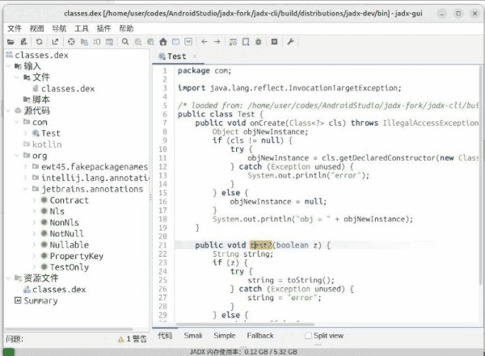

## 简介
创建函数的控制流图（CFG），以图片格式显示。

## 使用方法
使用 Jadx-GUI 打开一个反编译后的 Java 代码界面，鼠标放在一个函数名上右键 -> 查看控制流图。

打开控制流图界面后，鼠标左键拖拽，滚轮缩放，点击滚轮复原，右键复制为文本或图片。

## 可用选项
生成控制流图的类型：普通，RAW（包含原始 Instructions）， REGION（显示 Region 的划分）。 \
在 Jadx 的首选项中可以更改默认值。

## 运行依赖
需要安装 graphviz（用到 'dot' 命令）。

在 Linux, Jadx 1.5.3 上测试可以正常运行。

## 原理：
使用 Jadx 的 DotGraphVisitor.dump() / dumpRaw() / dumpRegion() 创建 .dot 文件，然后使用 'dot -Tpng' 命令将其转为 png 图片并显示。

----

## Introduction
Creates a Control Flow Graph (CFG) for a Java method and displays it as an image.

## Usage
Open a decompiled Java code interface with Jadx-GUI, right-click on a method's name -> "View method CFG".

After CFG is displayed, you can press mouse left button to drag, scroll wheel button to zoom, click scroll button to reset, right click to copy as text / image.

## Available Options
Dump CFG as GENERAL, RAW (raw instructions) or REGION (region divisions). The default value can be changed in Jadx's preferences.

## Runtime dependencies
Requires the installation of graphviz ('dot' command is used).

Tested on Linux, Jadx 1.5.3.

## How it Works
It uses Jadx's DotGraphVisitor.dump() / dumpRaw() / dumpRegion() to create a .dot file, and then uses the 'dot -Tpng' command to convert it to a PNG image for display.
